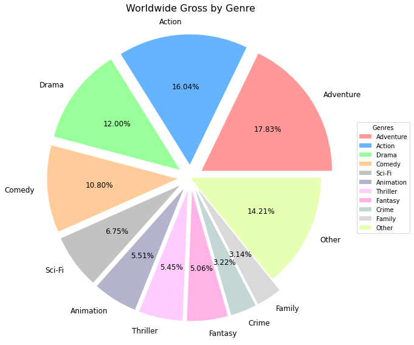

```python
#Business understanding
#Real world problem: How does Microsoft studio maximize Worldwide Gross? 
#Stakeholders Microsoft CEO, board and shareholders, project managers on team for Microsoft Studio, CFO
#This notebook should show the value of genre, runtime and budget on the worldwide gross
#importing pandas, numpy, matplotlib, seaborn, glob, sql and imdb, budget datasets
import pandas as pd
import numpy as np
import matplotlib.pyplot as plt
import seaborn as sns
from glob import glob
import os
from matplotlib.ticker import MultipleLocator
from matplotlib.ticker import FuncFormatter

import sqlite3
connection = sqlite3.connect("imdb")

%matplotlib inline


df = pd.read_csv('tn.movie_budgets.csv')
```


```python
#displaying data from tn.movie_budgets
# This dataset displays the release date, movie name, production budget and the domestic, ww gross. This project heavily was influenced on the budget and gross.
print(df.head())
```

       id  release_date                                        movie  \
    0   1  Dec 18, 2009                                       Avatar   
    1   2  May 20, 2011  Pirates of the Caribbean: On Stranger Tides   
    2   3   Jun 7, 2019                                 Dark Phoenix   
    3   4   May 1, 2015                      Avengers: Age of Ultron   
    4   5  Dec 15, 2017            Star Wars Ep. VIII: The Last Jedi   
    
      production_budget domestic_gross worldwide_gross  
    0      $425,000,000   $760,507,625  $2,776,345,279  
    1      $410,600,000   $241,063,875  $1,045,663,875  
    2      $350,000,000    $42,762,350    $149,762,350  
    3      $330,600,000   $459,005,868  $1,403,013,963  
    4      $317,000,000   $620,181,382  $1,316,721,747  


```python
#displaying the diffrent columns in the tn.movie_budgets/info about the dataset
for c in df.columns:
    print(c)
```

    id
    release_date
    movie
    production_budget
    domestic_gross
    worldwide_gross


```python
df.info()
```

    <class 'pandas.core.frame.DataFrame'>
    RangeIndex: 5782 entries, 0 to 5781
    Data columns (total 6 columns):
     #   Column             Non-Null Count  Dtype 
    ---  ------             --------------  ----- 
     0   id                 5782 non-null   int64 
     1   release_date       5782 non-null   object
     2   movie              5782 non-null   object
     3   production_budget  5782 non-null   object
     4   domestic_gross     5782 non-null   object
     5   worldwide_gross    5782 non-null   object
    dtypes: int64(1), object(5)
    memory usage: 271.2+ KB


```python
df.describe()
```


<div>
<style scoped>
    .dataframe tbody tr th:only-of-type {
        vertical-align: middle;
    }

    .dataframe tbody tr th {
        vertical-align: top;
    }

    .dataframe thead th {
        text-align: right;
    }
</style>
<table border="1" class="dataframe">
  <thead>
    <tr style="text-align: right;">
      <th></th>
      <th>id</th>
    </tr>
  </thead>
  <tbody>
    <tr>
      <th>count</th>
      <td>5782.000000</td>
    </tr>
    <tr>
      <th>mean</th>
      <td>50.372363</td>
    </tr>
    <tr>
      <th>std</th>
      <td>28.821076</td>
    </tr>
    <tr>
      <th>min</th>
      <td>1.000000</td>
    </tr>
    <tr>
      <th>25%</th>
      <td>25.000000</td>
    </tr>
    <tr>
      <th>50%</th>
      <td>50.000000</td>
    </tr>
    <tr>
      <th>75%</th>
      <td>75.000000</td>
    </tr>
    <tr>
      <th>max</th>
      <td>100.000000</td>
    </tr>
  </tbody>
</table>
</div>


```python
#displaying column info from IMDB 
#IMDB showed movie basics, directors, known for, movie akas, movie ratings, persons, principas, writers and movie
#Subcatagorie of movie basics had very important info including runtime and genre. These were used to make dec of what type of movie should be produced.
cursor = connection.cursor()
sql_query = """SELECT name FROM sqlite_master WHERE type='table';"""
cursor.execute(sql_query)
print(cursor.fetchall())
```

    [('movie_basics',), ('directors',), ('known_for',), ('movie_akas',), ('movie_ratings',), ('persons',), ('principals',), ('writers',), ('movie',)]


```python
#displaying movie_basics
movie_basics_df = pd.read_sql("""SELECT * FROM movie_basics""",connection)
movie_basics_df.head(100)


```


<div>
<style scoped>
    .dataframe tbody tr th:only-of-type {
        vertical-align: middle;
    }

    .dataframe tbody tr th {
        vertical-align: top;
    }

    .dataframe thead th {
        text-align: right;
    }
</style>
<table border="1" class="dataframe">
  <thead>
    <tr style="text-align: right;">
      <th></th>
      <th>movie_id</th>
      <th>primary_title</th>
      <th>original_title</th>
      <th>start_year</th>
      <th>runtime_minutes</th>
      <th>genres</th>
    </tr>
  </thead>
  <tbody>
    <tr>
      <th>0</th>
      <td>tt0063540</td>
      <td>Sunghursh</td>
      <td>Sunghursh</td>
      <td>2013</td>
      <td>175.0</td>
      <td>Action,Crime,Drama</td>
    </tr>
    <tr>
      <th>1</th>
      <td>tt0066787</td>
      <td>One Day Before the Rainy Season</td>
      <td>Ashad Ka Ek Din</td>
      <td>2019</td>
      <td>114.0</td>
      <td>Biography,Drama</td>
    </tr>
    <tr>
      <th>2</th>
      <td>tt0069049</td>
      <td>The Other Side of the Wind</td>
      <td>The Other Side of the Wind</td>
      <td>2018</td>
      <td>122.0</td>
      <td>Drama</td>
    </tr>
    <tr>
      <th>3</th>
      <td>tt0069204</td>
      <td>Sabse Bada Sukh</td>
      <td>Sabse Bada Sukh</td>
      <td>2018</td>
      <td>NaN</td>
      <td>Comedy,Drama</td>
    </tr>
    <tr>
      <th>4</th>
      <td>tt0100275</td>
      <td>The Wandering Soap Opera</td>
      <td>La Telenovela Errante</td>
      <td>2017</td>
      <td>80.0</td>
      <td>Comedy,Drama,Fantasy</td>
    </tr>
    <tr>
      <th>...</th>
      <td>...</td>
      <td>...</td>
      <td>...</td>
      <td>...</td>
      <td>...</td>
      <td>...</td>
    </tr>
    <tr>
      <th>95</th>
      <td>tt0429493</td>
      <td>The A-Team</td>
      <td>The A-Team</td>
      <td>2010</td>
      <td>117.0</td>
      <td>Action,Adventure,Thriller</td>
    </tr>
    <tr>
      <th>96</th>
      <td>tt0430524</td>
      <td>The Rescuer</td>
      <td>The Rescuer</td>
      <td>2011</td>
      <td>84.0</td>
      <td>Documentary</td>
    </tr>
    <tr>
      <th>97</th>
      <td>tt0431021</td>
      <td>The Possession</td>
      <td>The Possession</td>
      <td>2012</td>
      <td>92.0</td>
      <td>Horror,Mystery,Thriller</td>
    </tr>
    <tr>
      <th>98</th>
      <td>tt0432010</td>
      <td>The Queen of Sheba Meets the Atom Man</td>
      <td>The Queen of Sheba Meets the Atom Man</td>
      <td>2018</td>
      <td>110.0</td>
      <td>Comedy</td>
    </tr>
    <tr>
      <th>99</th>
      <td>tt0433035</td>
      <td>Real Steel</td>
      <td>Real Steel</td>
      <td>2011</td>
      <td>127.0</td>
      <td>Action,Drama,Family</td>
    </tr>
  </tbody>
</table>
<p>100 rows × 6 columns</p>
</div>


```python
movie_ratings_df = pd.read_sql("""SELECT * FROM movie_ratings""",connection)
movie_ratings_df.head(100)
```


<div>
<style scoped>
    .dataframe tbody tr th:only-of-type {
        vertical-align: middle;
    }

    .dataframe tbody tr th {
        vertical-align: top;
    }

    .dataframe thead th {
        text-align: right;
    }
</style>
<table border="1" class="dataframe">
  <thead>
    <tr style="text-align: right;">
      <th></th>
      <th>movie_id</th>
      <th>averagerating</th>
      <th>numvotes</th>
    </tr>
  </thead>
  <tbody>
    <tr>
      <th>0</th>
      <td>tt10356526</td>
      <td>8.3</td>
      <td>31</td>
    </tr>
    <tr>
      <th>1</th>
      <td>tt10384606</td>
      <td>8.9</td>
      <td>559</td>
    </tr>
    <tr>
      <th>2</th>
      <td>tt1042974</td>
      <td>6.4</td>
      <td>20</td>
    </tr>
    <tr>
      <th>3</th>
      <td>tt1043726</td>
      <td>4.2</td>
      <td>50352</td>
    </tr>
    <tr>
      <th>4</th>
      <td>tt1060240</td>
      <td>6.5</td>
      <td>21</td>
    </tr>
    <tr>
      <th>...</th>
      <td>...</td>
      <td>...</td>
      <td>...</td>
    </tr>
    <tr>
      <th>95</th>
      <td>tt1515069</td>
      <td>8.3</td>
      <td>15</td>
    </tr>
    <tr>
      <th>96</th>
      <td>tt1515208</td>
      <td>6.3</td>
      <td>1447</td>
    </tr>
    <tr>
      <th>97</th>
      <td>tt1516577</td>
      <td>5.3</td>
      <td>147</td>
    </tr>
    <tr>
      <th>98</th>
      <td>tt1516595</td>
      <td>4.4</td>
      <td>64</td>
    </tr>
    <tr>
      <th>99</th>
      <td>tt1517225</td>
      <td>7.4</td>
      <td>2189</td>
    </tr>
  </tbody>
</table>
<p>100 rows × 3 columns</p>
</div>


```python
#cleaning duplicates
print(movie_basics_df.duplicated().any())
print(movie_ratings_df.duplicated().any())
```

    False
    False


```python

```


```python

#Checking for Placeholders
movie_basics_df.isin(['?', '#', 'NaN', 'null', 'N/A', '-', 0]).sum()


```


    movie_id           0
    primary_title      0
    original_title     0
    start_year         0
    runtime_minutes    0
    genres             0
    dtype: int64


```python
#PANDAS and SQLITE dataframe
join_movie_id = """SELECT * 
FROM movie_basics
INNER JOIN movie_ratings
ON movie_basics.movie_id = movie_ratings.movie_id
"""
```


```python

imdb_df = pd.DataFrame(cursor.execute(join_movie_id).fetchall())
imdb_df.info()

```

    <class 'pandas.core.frame.DataFrame'>
    RangeIndex: 73856 entries, 0 to 73855
    Data columns (total 9 columns):
     #   Column  Non-Null Count  Dtype  
    ---  ------  --------------  -----  
     0   0       73856 non-null  object 
     1   1       73856 non-null  object 
     2   2       73856 non-null  object 
     3   3       73856 non-null  int64  
     4   4       66236 non-null  float64
     5   5       73052 non-null  object 
     6   6       73856 non-null  object 
     7   7       73856 non-null  float64
     8   8       73856 non-null  int64  
    dtypes: float64(2), int64(2), object(5)
    memory usage: 5.1+ MB


```python
#review IMDB
imdb_df.head()
```


<div>
<style scoped>
    .dataframe tbody tr th:only-of-type {
        vertical-align: middle;
    }

    .dataframe tbody tr th {
        vertical-align: top;
    }

    .dataframe thead th {
        text-align: right;
    }
</style>
<table border="1" class="dataframe">
  <thead>
    <tr style="text-align: right;">
      <th></th>
      <th>0</th>
      <th>1</th>
      <th>2</th>
      <th>3</th>
      <th>4</th>
      <th>5</th>
      <th>6</th>
      <th>7</th>
      <th>8</th>
    </tr>
  </thead>
  <tbody>
    <tr>
      <th>0</th>
      <td>tt0063540</td>
      <td>Sunghursh</td>
      <td>Sunghursh</td>
      <td>2013</td>
      <td>175.0</td>
      <td>Action,Crime,Drama</td>
      <td>tt0063540</td>
      <td>7.0</td>
      <td>77</td>
    </tr>
    <tr>
      <th>1</th>
      <td>tt0066787</td>
      <td>One Day Before the Rainy Season</td>
      <td>Ashad Ka Ek Din</td>
      <td>2019</td>
      <td>114.0</td>
      <td>Biography,Drama</td>
      <td>tt0066787</td>
      <td>7.2</td>
      <td>43</td>
    </tr>
    <tr>
      <th>2</th>
      <td>tt0069049</td>
      <td>The Other Side of the Wind</td>
      <td>The Other Side of the Wind</td>
      <td>2018</td>
      <td>122.0</td>
      <td>Drama</td>
      <td>tt0069049</td>
      <td>6.9</td>
      <td>4517</td>
    </tr>
    <tr>
      <th>3</th>
      <td>tt0069204</td>
      <td>Sabse Bada Sukh</td>
      <td>Sabse Bada Sukh</td>
      <td>2018</td>
      <td>NaN</td>
      <td>Comedy,Drama</td>
      <td>tt0069204</td>
      <td>6.1</td>
      <td>13</td>
    </tr>
    <tr>
      <th>4</th>
      <td>tt0100275</td>
      <td>The Wandering Soap Opera</td>
      <td>La Telenovela Errante</td>
      <td>2017</td>
      <td>80.0</td>
      <td>Comedy,Drama,Fantasy</td>
      <td>tt0100275</td>
      <td>6.5</td>
      <td>119</td>
    </tr>
  </tbody>
</table>
</div>


```python
#Merging movie basics and movie ratings into one database
imdb_df = pd.merge(left=movie_basics_df, right=movie_ratings_df, on="movie_id")
imdb_df.info()
```

    <class 'pandas.core.frame.DataFrame'>
    Int64Index: 73856 entries, 0 to 73855
    Data columns (total 8 columns):
     #   Column           Non-Null Count  Dtype  
    ---  ------           --------------  -----  
     0   movie_id         73856 non-null  object 
     1   primary_title    73856 non-null  object 
     2   original_title   73856 non-null  object 
     3   start_year       73856 non-null  int64  
     4   runtime_minutes  66236 non-null  float64
     5   genres           73052 non-null  object 
     6   averagerating    73856 non-null  float64
     7   numvotes         73856 non-null  int64  
    dtypes: float64(2), int64(2), object(4)
    memory usage: 5.1+ MB


```python
#check to see if they merged
imdb_df.head()
```


<div>
<style scoped>
    .dataframe tbody tr th:only-of-type {
        vertical-align: middle;
    }

    .dataframe tbody tr th {
        vertical-align: top;
    }

    .dataframe thead th {
        text-align: right;
    }
</style>
<table border="1" class="dataframe">
  <thead>
    <tr style="text-align: right;">
      <th></th>
      <th>movie_id</th>
      <th>primary_title</th>
      <th>original_title</th>
      <th>start_year</th>
      <th>runtime_minutes</th>
      <th>genres</th>
      <th>averagerating</th>
      <th>numvotes</th>
    </tr>
  </thead>
  <tbody>
    <tr>
      <th>0</th>
      <td>tt0063540</td>
      <td>Sunghursh</td>
      <td>Sunghursh</td>
      <td>2013</td>
      <td>175.0</td>
      <td>Action,Crime,Drama</td>
      <td>7.0</td>
      <td>77</td>
    </tr>
    <tr>
      <th>1</th>
      <td>tt0066787</td>
      <td>One Day Before the Rainy Season</td>
      <td>Ashad Ka Ek Din</td>
      <td>2019</td>
      <td>114.0</td>
      <td>Biography,Drama</td>
      <td>7.2</td>
      <td>43</td>
    </tr>
    <tr>
      <th>2</th>
      <td>tt0069049</td>
      <td>The Other Side of the Wind</td>
      <td>The Other Side of the Wind</td>
      <td>2018</td>
      <td>122.0</td>
      <td>Drama</td>
      <td>6.9</td>
      <td>4517</td>
    </tr>
    <tr>
      <th>3</th>
      <td>tt0069204</td>
      <td>Sabse Bada Sukh</td>
      <td>Sabse Bada Sukh</td>
      <td>2018</td>
      <td>NaN</td>
      <td>Comedy,Drama</td>
      <td>6.1</td>
      <td>13</td>
    </tr>
    <tr>
      <th>4</th>
      <td>tt0100275</td>
      <td>The Wandering Soap Opera</td>
      <td>La Telenovela Errante</td>
      <td>2017</td>
      <td>80.0</td>
      <td>Comedy,Drama,Fantasy</td>
      <td>6.5</td>
      <td>119</td>
    </tr>
  </tbody>
</table>
</div>


```python
#changing primary title to movie
imdb_df. rename(columns = {"primary_title":"movie"}, inplace = True)
imdb_df.head()
```


<div>
<style scoped>
    .dataframe tbody tr th:only-of-type {
        vertical-align: middle;
    }

    .dataframe tbody tr th {
        vertical-align: top;
    }

    .dataframe thead th {
        text-align: right;
    }
</style>
<table border="1" class="dataframe">
  <thead>
    <tr style="text-align: right;">
      <th></th>
      <th>movie_id</th>
      <th>movie</th>
      <th>original_title</th>
      <th>start_year</th>
      <th>runtime_minutes</th>
      <th>genres</th>
      <th>averagerating</th>
      <th>numvotes</th>
    </tr>
  </thead>
  <tbody>
    <tr>
      <th>0</th>
      <td>tt0063540</td>
      <td>Sunghursh</td>
      <td>Sunghursh</td>
      <td>2013</td>
      <td>175.0</td>
      <td>Action,Crime,Drama</td>
      <td>7.0</td>
      <td>77</td>
    </tr>
    <tr>
      <th>1</th>
      <td>tt0066787</td>
      <td>One Day Before the Rainy Season</td>
      <td>Ashad Ka Ek Din</td>
      <td>2019</td>
      <td>114.0</td>
      <td>Biography,Drama</td>
      <td>7.2</td>
      <td>43</td>
    </tr>
    <tr>
      <th>2</th>
      <td>tt0069049</td>
      <td>The Other Side of the Wind</td>
      <td>The Other Side of the Wind</td>
      <td>2018</td>
      <td>122.0</td>
      <td>Drama</td>
      <td>6.9</td>
      <td>4517</td>
    </tr>
    <tr>
      <th>3</th>
      <td>tt0069204</td>
      <td>Sabse Bada Sukh</td>
      <td>Sabse Bada Sukh</td>
      <td>2018</td>
      <td>NaN</td>
      <td>Comedy,Drama</td>
      <td>6.1</td>
      <td>13</td>
    </tr>
    <tr>
      <th>4</th>
      <td>tt0100275</td>
      <td>The Wandering Soap Opera</td>
      <td>La Telenovela Errante</td>
      <td>2017</td>
      <td>80.0</td>
      <td>Comedy,Drama,Fantasy</td>
      <td>6.5</td>
      <td>119</td>
    </tr>
  </tbody>
</table>
</div>


```python
#full combined merge of IMDB and tn.movie _budget
full_df = pd.merge(left=df, right=imdb_df, on="movie")
full_df.info()
```

    <class 'pandas.core.frame.DataFrame'>
    Int64Index: 2875 entries, 0 to 2874
    Data columns (total 13 columns):
     #   Column             Non-Null Count  Dtype  
    ---  ------             --------------  -----  
     0   id                 2875 non-null   int64  
     1   release_date       2875 non-null   object 
     2   movie              2875 non-null   object 
     3   production_budget  2875 non-null   object 
     4   domestic_gross     2875 non-null   object 
     5   worldwide_gross    2875 non-null   object 
     6   movie_id           2875 non-null   object 
     7   original_title     2875 non-null   object 
     8   start_year         2875 non-null   int64  
     9   runtime_minutes    2757 non-null   float64
     10  genres             2867 non-null   object 
     11  averagerating      2875 non-null   float64
     12  numvotes           2875 non-null   int64  
    dtypes: float64(2), int64(3), object(8)
    memory usage: 314.5+ KB


```python
full_df.head()
```


<div>
<style scoped>
    .dataframe tbody tr th:only-of-type {
        vertical-align: middle;
    }

    .dataframe tbody tr th {
        vertical-align: top;
    }

    .dataframe thead th {
        text-align: right;
    }
</style>
<table border="1" class="dataframe">
  <thead>
    <tr style="text-align: right;">
      <th></th>
      <th>id</th>
      <th>release_date</th>
      <th>movie</th>
      <th>production_budget</th>
      <th>domestic_gross</th>
      <th>worldwide_gross</th>
      <th>movie_id</th>
      <th>original_title</th>
      <th>start_year</th>
      <th>runtime_minutes</th>
      <th>genres</th>
      <th>averagerating</th>
      <th>numvotes</th>
    </tr>
  </thead>
  <tbody>
    <tr>
      <th>0</th>
      <td>1</td>
      <td>Dec 18, 2009</td>
      <td>Avatar</td>
      <td>$425,000,000</td>
      <td>$760,507,625</td>
      <td>$2,776,345,279</td>
      <td>tt1775309</td>
      <td>Abatâ</td>
      <td>2011</td>
      <td>93.0</td>
      <td>Horror</td>
      <td>6.1</td>
      <td>43</td>
    </tr>
    <tr>
      <th>1</th>
      <td>2</td>
      <td>May 20, 2011</td>
      <td>Pirates of the Caribbean: On Stranger Tides</td>
      <td>$410,600,000</td>
      <td>$241,063,875</td>
      <td>$1,045,663,875</td>
      <td>tt1298650</td>
      <td>Pirates of the Caribbean: On Stranger Tides</td>
      <td>2011</td>
      <td>136.0</td>
      <td>Action,Adventure,Fantasy</td>
      <td>6.6</td>
      <td>447624</td>
    </tr>
    <tr>
      <th>2</th>
      <td>3</td>
      <td>Jun 7, 2019</td>
      <td>Dark Phoenix</td>
      <td>$350,000,000</td>
      <td>$42,762,350</td>
      <td>$149,762,350</td>
      <td>tt6565702</td>
      <td>Dark Phoenix</td>
      <td>2019</td>
      <td>113.0</td>
      <td>Action,Adventure,Sci-Fi</td>
      <td>6.0</td>
      <td>24451</td>
    </tr>
    <tr>
      <th>3</th>
      <td>4</td>
      <td>May 1, 2015</td>
      <td>Avengers: Age of Ultron</td>
      <td>$330,600,000</td>
      <td>$459,005,868</td>
      <td>$1,403,013,963</td>
      <td>tt2395427</td>
      <td>Avengers: Age of Ultron</td>
      <td>2015</td>
      <td>141.0</td>
      <td>Action,Adventure,Sci-Fi</td>
      <td>7.3</td>
      <td>665594</td>
    </tr>
    <tr>
      <th>4</th>
      <td>7</td>
      <td>Apr 27, 2018</td>
      <td>Avengers: Infinity War</td>
      <td>$300,000,000</td>
      <td>$678,815,482</td>
      <td>$2,048,134,200</td>
      <td>tt4154756</td>
      <td>Avengers: Infinity War</td>
      <td>2018</td>
      <td>149.0</td>
      <td>Action,Adventure,Sci-Fi</td>
      <td>8.5</td>
      <td>670926</td>
    </tr>
  </tbody>
</table>
</div>


```python
#removing unneeded data =orignial_title, start_year, Movie_id, id
full_df.drop(["original_title", "movie_id", "start_year","id","averagerating", "numvotes"], axis=1, inplace=True)
```


```python
#checking to see if data was removed
full_df.head()
```


<div>
<style scoped>
    .dataframe tbody tr th:only-of-type {
        vertical-align: middle;
    }

    .dataframe tbody tr th {
        vertical-align: top;
    }

    .dataframe thead th {
        text-align: right;
    }
</style>
<table border="1" class="dataframe">
  <thead>
    <tr style="text-align: right;">
      <th></th>
      <th>release_date</th>
      <th>movie</th>
      <th>production_budget</th>
      <th>domestic_gross</th>
      <th>worldwide_gross</th>
      <th>runtime_minutes</th>
      <th>genres</th>
    </tr>
  </thead>
  <tbody>
    <tr>
      <th>0</th>
      <td>Dec 18, 2009</td>
      <td>Avatar</td>
      <td>$425,000,000</td>
      <td>$760,507,625</td>
      <td>$2,776,345,279</td>
      <td>93.0</td>
      <td>Horror</td>
    </tr>
    <tr>
      <th>1</th>
      <td>May 20, 2011</td>
      <td>Pirates of the Caribbean: On Stranger Tides</td>
      <td>$410,600,000</td>
      <td>$241,063,875</td>
      <td>$1,045,663,875</td>
      <td>136.0</td>
      <td>Action,Adventure,Fantasy</td>
    </tr>
    <tr>
      <th>2</th>
      <td>Jun 7, 2019</td>
      <td>Dark Phoenix</td>
      <td>$350,000,000</td>
      <td>$42,762,350</td>
      <td>$149,762,350</td>
      <td>113.0</td>
      <td>Action,Adventure,Sci-Fi</td>
    </tr>
    <tr>
      <th>3</th>
      <td>May 1, 2015</td>
      <td>Avengers: Age of Ultron</td>
      <td>$330,600,000</td>
      <td>$459,005,868</td>
      <td>$1,403,013,963</td>
      <td>141.0</td>
      <td>Action,Adventure,Sci-Fi</td>
    </tr>
    <tr>
      <th>4</th>
      <td>Apr 27, 2018</td>
      <td>Avengers: Infinity War</td>
      <td>$300,000,000</td>
      <td>$678,815,482</td>
      <td>$2,048,134,200</td>
      <td>149.0</td>
      <td>Action,Adventure,Sci-Fi</td>
    </tr>
  </tbody>
</table>
</div>


```python
#review for missing data/remove
cleaned_df = full_df.dropna(subset=['production_budget'])
cleaned_df.info()
```

    <class 'pandas.core.frame.DataFrame'>
    Int64Index: 2875 entries, 0 to 2874
    Data columns (total 7 columns):
     #   Column             Non-Null Count  Dtype  
    ---  ------             --------------  -----  
     0   release_date       2875 non-null   object 
     1   movie              2875 non-null   object 
     2   production_budget  2875 non-null   object 
     3   domestic_gross     2875 non-null   object 
     4   worldwide_gross    2875 non-null   object 
     5   runtime_minutes    2757 non-null   float64
     6   genres             2867 non-null   object 
    dtypes: float64(1), object(6)
    memory usage: 179.7+ KB


```python
cleaned_df = full_df.dropna(subset=['production_budget', 'domestic_gross', 'worldwide_gross', 'runtime_minutes', 'genres'])
cleaned_df.info()
```

    <class 'pandas.core.frame.DataFrame'>
    Int64Index: 2752 entries, 0 to 2874
    Data columns (total 7 columns):
     #   Column             Non-Null Count  Dtype  
    ---  ------             --------------  -----  
     0   release_date       2752 non-null   object 
     1   movie              2752 non-null   object 
     2   production_budget  2752 non-null   object 
     3   domestic_gross     2752 non-null   object 
     4   worldwide_gross    2752 non-null   object 
     5   runtime_minutes    2752 non-null   float64
     6   genres             2752 non-null   object 
    dtypes: float64(1), object(6)
    memory usage: 172.0+ KB


```python
cleaned_df = cleaned_df.dropna(subset=['worldwide_gross'])
cleaned_df.info()
```

    <class 'pandas.core.frame.DataFrame'>
    Int64Index: 2752 entries, 0 to 2874
    Data columns (total 7 columns):
     #   Column             Non-Null Count  Dtype  
    ---  ------             --------------  -----  
     0   release_date       2752 non-null   object 
     1   movie              2752 non-null   object 
     2   production_budget  2752 non-null   object 
     3   domestic_gross     2752 non-null   object 
     4   worldwide_gross    2752 non-null   object 
     5   runtime_minutes    2752 non-null   float64
     6   genres             2752 non-null   object 
    dtypes: float64(1), object(6)
    memory usage: 172.0+ KB


```python
cleaned_df = cleaned_df.dropna(subset=['runtime_minutes'])
cleaned_df.info()
```

    <class 'pandas.core.frame.DataFrame'>
    Int64Index: 2752 entries, 0 to 2874
    Data columns (total 7 columns):
     #   Column             Non-Null Count  Dtype  
    ---  ------             --------------  -----  
     0   release_date       2752 non-null   object 
     1   movie              2752 non-null   object 
     2   production_budget  2752 non-null   object 
     3   domestic_gross     2752 non-null   object 
     4   worldwide_gross    2752 non-null   object 
     5   runtime_minutes    2752 non-null   float64
     6   genres             2752 non-null   object 
    dtypes: float64(1), object(6)
    memory usage: 172.0+ KB


```python
# Adjusting type of data for production_budget, worldwide_gross , domestic_gross
#From object to int

cleaned_df['production_budget'] = cleaned_df['production_budget'].str.replace(',', '')
cleaned_df['production_budget'] = cleaned_df['production_budget'].str.replace('$', '')
cleaned_df['production_budget'] = cleaned_df['production_budget'].astype(int)
```


```python
cleaned_df.head()
```


<div>
<style scoped>
    .dataframe tbody tr th:only-of-type {
        vertical-align: middle;
    }

    .dataframe tbody tr th {
        vertical-align: top;
    }

    .dataframe thead th {
        text-align: right;
    }
</style>
<table border="1" class="dataframe">
  <thead>
    <tr style="text-align: right;">
      <th></th>
      <th>release_date</th>
      <th>movie</th>
      <th>production_budget</th>
      <th>domestic_gross</th>
      <th>worldwide_gross</th>
      <th>runtime_minutes</th>
      <th>genres</th>
    </tr>
  </thead>
  <tbody>
    <tr>
      <th>0</th>
      <td>Dec 18, 2009</td>
      <td>Avatar</td>
      <td>425000000</td>
      <td>$760,507,625</td>
      <td>$2,776,345,279</td>
      <td>93.0</td>
      <td>Horror</td>
    </tr>
    <tr>
      <th>1</th>
      <td>May 20, 2011</td>
      <td>Pirates of the Caribbean: On Stranger Tides</td>
      <td>410600000</td>
      <td>$241,063,875</td>
      <td>$1,045,663,875</td>
      <td>136.0</td>
      <td>Action,Adventure,Fantasy</td>
    </tr>
    <tr>
      <th>2</th>
      <td>Jun 7, 2019</td>
      <td>Dark Phoenix</td>
      <td>350000000</td>
      <td>$42,762,350</td>
      <td>$149,762,350</td>
      <td>113.0</td>
      <td>Action,Adventure,Sci-Fi</td>
    </tr>
    <tr>
      <th>3</th>
      <td>May 1, 2015</td>
      <td>Avengers: Age of Ultron</td>
      <td>330600000</td>
      <td>$459,005,868</td>
      <td>$1,403,013,963</td>
      <td>141.0</td>
      <td>Action,Adventure,Sci-Fi</td>
    </tr>
    <tr>
      <th>4</th>
      <td>Apr 27, 2018</td>
      <td>Avengers: Infinity War</td>
      <td>300000000</td>
      <td>$678,815,482</td>
      <td>$2,048,134,200</td>
      <td>149.0</td>
      <td>Action,Adventure,Sci-Fi</td>
    </tr>
  </tbody>
</table>
</div>


```python
cleaned_df['domestic_gross'] = cleaned_df['domestic_gross'].str.replace(',', '')
cleaned_df['domestic_gross'] = cleaned_df['domestic_gross'].str.replace('$', '')
cleaned_df['domestic_gross'] = cleaned_df['domestic_gross'].astype(int)
```


```python
cleaned_df.head()
```


<div>
<style scoped>
    .dataframe tbody tr th:only-of-type {
        vertical-align: middle;
    }

    .dataframe tbody tr th {
        vertical-align: top;
    }

    .dataframe thead th {
        text-align: right;
    }
</style>
<table border="1" class="dataframe">
  <thead>
    <tr style="text-align: right;">
      <th></th>
      <th>release_date</th>
      <th>movie</th>
      <th>production_budget</th>
      <th>domestic_gross</th>
      <th>worldwide_gross</th>
      <th>runtime_minutes</th>
      <th>genres</th>
    </tr>
  </thead>
  <tbody>
    <tr>
      <th>0</th>
      <td>Dec 18, 2009</td>
      <td>Avatar</td>
      <td>425000000</td>
      <td>760507625</td>
      <td>$2,776,345,279</td>
      <td>93.0</td>
      <td>Horror</td>
    </tr>
    <tr>
      <th>1</th>
      <td>May 20, 2011</td>
      <td>Pirates of the Caribbean: On Stranger Tides</td>
      <td>410600000</td>
      <td>241063875</td>
      <td>$1,045,663,875</td>
      <td>136.0</td>
      <td>Action,Adventure,Fantasy</td>
    </tr>
    <tr>
      <th>2</th>
      <td>Jun 7, 2019</td>
      <td>Dark Phoenix</td>
      <td>350000000</td>
      <td>42762350</td>
      <td>$149,762,350</td>
      <td>113.0</td>
      <td>Action,Adventure,Sci-Fi</td>
    </tr>
    <tr>
      <th>3</th>
      <td>May 1, 2015</td>
      <td>Avengers: Age of Ultron</td>
      <td>330600000</td>
      <td>459005868</td>
      <td>$1,403,013,963</td>
      <td>141.0</td>
      <td>Action,Adventure,Sci-Fi</td>
    </tr>
    <tr>
      <th>4</th>
      <td>Apr 27, 2018</td>
      <td>Avengers: Infinity War</td>
      <td>300000000</td>
      <td>678815482</td>
      <td>$2,048,134,200</td>
      <td>149.0</td>
      <td>Action,Adventure,Sci-Fi</td>
    </tr>
  </tbody>
</table>
</div>


```python
cleaned_df['worldwide_gross'] = cleaned_df['worldwide_gross'].str.replace(',', '')
cleaned_df['worldwide_gross'] = cleaned_df['worldwide_gross'].str.replace('$', '')
cleaned_df['worldwide_gross'] = cleaned_df['worldwide_gross'].astype(int)
```


```python
cleaned_df.head()
```


<div>
<style scoped>
    .dataframe tbody tr th:only-of-type {
        vertical-align: middle;
    }

    .dataframe tbody tr th {
        vertical-align: top;
    }

    .dataframe thead th {
        text-align: right;
    }
</style>
<table border="1" class="dataframe">
  <thead>
    <tr style="text-align: right;">
      <th></th>
      <th>release_date</th>
      <th>movie</th>
      <th>production_budget</th>
      <th>domestic_gross</th>
      <th>worldwide_gross</th>
      <th>runtime_minutes</th>
      <th>genres</th>
    </tr>
  </thead>
  <tbody>
    <tr>
      <th>0</th>
      <td>Dec 18, 2009</td>
      <td>Avatar</td>
      <td>425000000</td>
      <td>760507625</td>
      <td>2776345279</td>
      <td>93.0</td>
      <td>Horror</td>
    </tr>
    <tr>
      <th>1</th>
      <td>May 20, 2011</td>
      <td>Pirates of the Caribbean: On Stranger Tides</td>
      <td>410600000</td>
      <td>241063875</td>
      <td>1045663875</td>
      <td>136.0</td>
      <td>Action,Adventure,Fantasy</td>
    </tr>
    <tr>
      <th>2</th>
      <td>Jun 7, 2019</td>
      <td>Dark Phoenix</td>
      <td>350000000</td>
      <td>42762350</td>
      <td>149762350</td>
      <td>113.0</td>
      <td>Action,Adventure,Sci-Fi</td>
    </tr>
    <tr>
      <th>3</th>
      <td>May 1, 2015</td>
      <td>Avengers: Age of Ultron</td>
      <td>330600000</td>
      <td>459005868</td>
      <td>1403013963</td>
      <td>141.0</td>
      <td>Action,Adventure,Sci-Fi</td>
    </tr>
    <tr>
      <th>4</th>
      <td>Apr 27, 2018</td>
      <td>Avengers: Infinity War</td>
      <td>300000000</td>
      <td>678815482</td>
      <td>2048134200</td>
      <td>149.0</td>
      <td>Action,Adventure,Sci-Fi</td>
    </tr>
  </tbody>
</table>
</div>


```python
cleaned_df = cleaned_df.dropna(subset=['genres'])
cleaned_df.info()
```

    <class 'pandas.core.frame.DataFrame'>
    Int64Index: 2752 entries, 0 to 2874
    Data columns (total 7 columns):
     #   Column             Non-Null Count  Dtype  
    ---  ------             --------------  -----  
     0   release_date       2752 non-null   object 
     1   movie              2752 non-null   object 
     2   production_budget  2752 non-null   int64  
     3   domestic_gross     2752 non-null   int64  
     4   worldwide_gross    2752 non-null   int64  
     5   runtime_minutes    2752 non-null   float64
     6   genres             2752 non-null   object 
    dtypes: float64(1), int64(3), object(3)
    memory usage: 172.0+ KB


```python
#plots
sns.pairplot(cleaned_df)
```


    <seaborn.axisgrid.PairGrid at 0x7f7e6be04250>


    

    


```python
#Review columns of cleaned data
c = list(cleaned_df.columns)
c = c[1:]
```


```python
c
```


    ['movie',
     'production_budget',
     'domestic_gross',
     'worldwide_gross',
     'runtime_minutes',
     'genres']


```python
#worldwide gross by budget
total_gross = cleaned_df.sort_values(by="worldwide_gross", ascending=False)
total_gross.head(10)
```


<div>
<style scoped>
    .dataframe tbody tr th:only-of-type {
        vertical-align: middle;
    }

    .dataframe tbody tr th {
        vertical-align: top;
    }

    .dataframe thead th {
        text-align: right;
    }
</style>
<table border="1" class="dataframe">
  <thead>
    <tr style="text-align: right;">
      <th></th>
      <th>release_date</th>
      <th>movie</th>
      <th>production_budget</th>
      <th>domestic_gross</th>
      <th>worldwide_gross</th>
      <th>runtime_minutes</th>
      <th>genres</th>
    </tr>
  </thead>
  <tbody>
    <tr>
      <th>0</th>
      <td>Dec 18, 2009</td>
      <td>Avatar</td>
      <td>425000000</td>
      <td>760507625</td>
      <td>2776345279</td>
      <td>93.0</td>
      <td>Horror</td>
    </tr>
    <tr>
      <th>4</th>
      <td>Apr 27, 2018</td>
      <td>Avengers: Infinity War</td>
      <td>300000000</td>
      <td>678815482</td>
      <td>2048134200</td>
      <td>149.0</td>
      <td>Action,Adventure,Sci-Fi</td>
    </tr>
    <tr>
      <th>25</th>
      <td>Jun 12, 2015</td>
      <td>Jurassic World</td>
      <td>215000000</td>
      <td>652270625</td>
      <td>1648854864</td>
      <td>124.0</td>
      <td>Action,Adventure,Sci-Fi</td>
    </tr>
    <tr>
      <th>59</th>
      <td>Apr 3, 2015</td>
      <td>Furious 7</td>
      <td>190000000</td>
      <td>353007020</td>
      <td>1518722794</td>
      <td>137.0</td>
      <td>Action,Crime,Thriller</td>
    </tr>
    <tr>
      <th>19</th>
      <td>May 4, 2012</td>
      <td>The Avengers</td>
      <td>225000000</td>
      <td>623279547</td>
      <td>1517935897</td>
      <td>143.0</td>
      <td>Action,Adventure,Sci-Fi</td>
    </tr>
    <tr>
      <th>3</th>
      <td>May 1, 2015</td>
      <td>Avengers: Age of Ultron</td>
      <td>330600000</td>
      <td>459005868</td>
      <td>1403013963</td>
      <td>141.0</td>
      <td>Action,Adventure,Sci-Fi</td>
    </tr>
    <tr>
      <th>36</th>
      <td>Feb 16, 2018</td>
      <td>Black Panther</td>
      <td>200000000</td>
      <td>700059566</td>
      <td>1348258224</td>
      <td>134.0</td>
      <td>Action,Adventure,Sci-Fi</td>
    </tr>
    <tr>
      <th>100</th>
      <td>Jun 22, 2018</td>
      <td>Jurassic World: Fallen Kingdom</td>
      <td>170000000</td>
      <td>417719760</td>
      <td>1305772799</td>
      <td>128.0</td>
      <td>Action,Adventure,Sci-Fi</td>
    </tr>
    <tr>
      <th>138</th>
      <td>Nov 22, 2013</td>
      <td>Frozen</td>
      <td>150000000</td>
      <td>400738009</td>
      <td>1272469910</td>
      <td>93.0</td>
      <td>Adventure,Drama,Sport</td>
    </tr>
    <tr>
      <th>139</th>
      <td>Nov 22, 2013</td>
      <td>Frozen</td>
      <td>150000000</td>
      <td>400738009</td>
      <td>1272469910</td>
      <td>92.0</td>
      <td>Fantasy,Romance</td>
    </tr>
  </tbody>
</table>
</div>


```python
#What is the longest movie?
total_gross["runtime_minutes"].max()
```


    280.0


```python
#Genres
print(cleaned_df["genres"].unique())
```

    ['Horror' 'Action,Adventure,Fantasy' 'Action,Adventure,Sci-Fi'
     'Action,Adventure,Thriller' 'Action,Thriller' 'Action,Adventure,Western'
     'Adventure,Animation,Comedy' 'Adventure,Family,Fantasy'
     'Adventure,Fantasy' 'Action,Crime,Thriller' 'Action,Adventure,Comedy'
     'Action,Adventure,Drama' 'Action,Drama' 'Action,Adventure,Animation'
     'Fantasy,Musical' 'Action,Adventure,Horror' 'Drama,Romance'
     'Comedy,Drama,Family' 'Drama,Mystery,Sci-Fi' 'Adventure,Comedy,Family'
     'Action,Adventure,Family' 'Adventure,Drama,Family' 'Documentary'
     'Action,Horror,Sci-Fi' 'Action,Sci-Fi' 'Animation' 'Crime,Drama' 'Family'
     'Biography,Documentary,History' 'Adventure,Drama,Sci-Fi'
     'Drama,Fantasy,Romance' 'Family,Fantasy,Musical' 'Action,Drama,History'
     'Sci-Fi' 'Documentary,Drama,Sport' 'Adventure,Drama,Sport'
     'Fantasy,Romance' 'Comedy,Fantasy,Horror' 'Action,Drama,Thriller'
     'Drama,Fantasy,Horror' 'Adventure,Animation,Family'
     'Adventure,Animation,Drama' 'Action,Comedy,Fantasy'
     'Action,Adventure,Biography' 'Drama' 'Drama,Horror,Thriller'
     'Drama,Romance,Thriller' 'Comedy,Family,Fantasy'
     'Action,Animation,Comedy' 'Action,Mystery,Thriller' 'Drama,Thriller'
     'Action,Drama,Sci-Fi' 'Action,Adventure,Crime' 'Adventure,Mystery,Sci-Fi'
     'Action,Adventure,Mystery' 'Adventure,Drama,Fantasy' 'Thriller'
     'Action,Crime,Sci-Fi' 'Comedy,Drama' 'Action,Sci-Fi,Thriller'
     'Drama,Sci-Fi,Thriller' 'Action,Fantasy,War' 'Drama,Romance,Sci-Fi'
     'Action,Comedy,Crime' 'Action,Drama,Family' 'Action,Drama,Romance'
     'Action,Drama,Mystery' 'Drama,Western' 'Comedy,Romance'
     'Biography,Crime,Drama' 'Comedy' 'Action,Crime,Sport'
     'Horror,Sci-Fi,Thriller' 'Drama,Family,Fantasy' 'Comedy,Drama,Romance'
     'Action,Crime' 'Adventure,Comedy,Drama' 'Adventure' 'Crime,Drama,Mystery'
     'Documentary,History' 'Action,Comedy' 'Action,Comedy,Sci-Fi'
     'Action,Adventure,Romance' 'Drama,History' 'Action,Family,Fantasy'
     'Action,Crime,Fantasy' 'Adventure,Drama' 'Animation,Comedy,Family'
     'Action,Comedy,Family' 'Drama,Fantasy,Musical' 'Action,Comedy,Horror'
     'Biography,Drama,Musical' 'Drama,Horror,Mystery'
     'Biography,Documentary,Drama' 'Comedy,Mystery' 'Mystery,Thriller'
     'Action,Drama,War' 'Comedy,Family,Romance' 'Horror,Thriller'
     'Crime,Horror,Thriller' 'Drama,Mystery,Thriller' 'Romance' 'Action'
     'Crime,Mystery,Thriller' 'Action,Drama,Fantasy' 'Biography,Drama'
     'Action,Comedy,Romance' 'Action,Crime,Drama' 'Comedy,Drama,History'
     'Adventure,Biography,Documentary' 'Biography,Drama,Thriller'
     'Drama,History,War' 'Drama,Family' 'Crime,Drama,Thriller'
     'Action,Thriller,War' 'Action,Mystery,Sci-Fi' 'Action,Animation,Fantasy'
     'Comedy,Drama,Musical' 'Action,Crime,Mystery' 'Crime,Documentary,Drama'
     'Drama,Sci-Fi' 'Action,Fantasy,Horror' 'Biography,Crime,Documentary'
     'Comedy,Romance,Sci-Fi' 'Biography,Drama,History' 'Crime,Drama,Family'
     'Biography,Drama,Sport' 'Adventure,Comedy' 'Biography,Drama,Western'
     'Comedy,Crime,Drama' 'Crime,Thriller' 'Biography,Comedy,Drama' 'Mystery'
     'Drama,Sport' 'Comedy,Western' 'Documentary,Family'
     'Action,Biography,Drama' 'Action,Fantasy,Thriller'
     'Biography,Drama,Music' 'Comedy,Crime,Romance' 'Adventure,Comedy,Crime'
     'Drama,Music,Musical' 'Horror,Mystery,Thriller' 'Adventure,Drama,Horror'
     'Drama,Musical,Romance' 'Comedy,Fantasy' 'Crime'
     'Romance,Sci-Fi,Thriller' 'Mystery,Sci-Fi,Thriller' 'Action,Comedy,Drama'
     'Action,Biography,Comedy' 'Comedy,Family' 'Adventure,Comedy,Fantasy'
     'Crime,Drama,History' 'Adventure,Drama,Thriller'
     'Biography,Documentary,Sport' 'Comedy,Drama,Thriller'
     'Adventure,Drama,History' 'Drama,War' 'Comedy,Music' 'Drama,Horror'
     'Animation,Family,Fantasy' 'Animation,Drama,Fantasy'
     'Action,Comedy,Sport' 'Fantasy,Horror,Mystery' 'Action,Fantasy,Western'
     'Comedy,Crime' 'Drama,History,Thriller' 'Adventure,Comedy,Music'
     'Horror,Mystery' 'Adventure,Comedy,Sci-Fi' 'War' 'Comedy,Drama,Sport'
     'Comedy,Horror,Thriller' 'Biography,Drama,Family' 'Drama,Horror,Sci-Fi'
     'Horror,Mystery,Sci-Fi' 'Action,History' 'Documentary,Music'
     'Comedy,Sci-Fi' 'Biography,Drama,War' 'Adventure,Biography,Drama'
     'Adventure,Drama,Western' 'Adventure,Documentary,Drama'
     'Crime,Drama,Horror' 'Drama,Fantasy' 'Animation,Comedy,Drama'
     'Comedy,Romance,Sport' 'Documentary,News' 'Adventure,Comedy,Romance'
     'Drama,Music,Romance' 'Comedy,Horror,Sci-Fi' 'Sci-Fi,Thriller'
     'Comedy,Horror,Romance' 'Adventure,Documentary' 'Comedy,Fantasy,Romance'
     'Comedy,Crime,Thriller' 'Documentary,Drama' 'Biography,Documentary,Music'
     'Biography,Documentary' 'Comedy,Horror' 'Adventure,Drama,Romance'
     'Drama,Music' 'Action,Sport' 'Action,Biography,Crime'
     'Drama,History,Sport' 'Biography,Drama,Romance' 'Animation,Sci-Fi'
     'Comedy,Drama,Music' 'Action,Drama,Sport' 'Documentary,Drama,Family'
     'Adventure,Fantasy,Mystery' 'Drama,Romance,War' 'Action,Horror,Mystery'
     'Fantasy,Horror,Thriller' 'Fantasy' 'Drama,Mystery'
     'Drama,History,Romance' 'Action,Drama,Western' 'Biography,Drama,Mystery'
     'Drama,Mystery,Romance' 'Family,Horror,Romance' 'Action,Romance,Thriller'
     'Drama,Fantasy,Mystery' 'Comedy,Music,Romance' 'Drama,Fantasy,Sci-Fi'
     'Action,Comedy,Documentary' 'Crime,Horror,Mystery' 'Musical'
     'Comedy,Mystery,Thriller' 'Comedy,Drama,Fantasy' 'Sport'
     'Crime,Fantasy,Thriller' 'Comedy,Sport' 'Adventure,Documentary,History'
     'Music' 'Drama,Family,Music' 'Documentary,War' 'Comedy,Mystery,Sci-Fi'
     'Animation,Drama' 'Drama,Family,Sport' 'Horror,Music,Thriller'
     'Comedy,Music,War' 'Action,Documentary' 'Adventure,Animation'
     'Action,Adventure' 'Action,Documentary,Drama' 'Adventure,Family,Sci-Fi'
     'Drama,Thriller,War' 'Biography,Comedy,Crime' 'Drama,Mystery,War'
     'Comedy,Drama,Mystery' 'Documentary,Drama,News' 'Adventure,Crime,Drama'
     'Drama,Fantasy,Music' 'Adventure,Horror,Sci-Fi' 'Adventure,Comedy,Horror'
     'Comedy,Documentary' 'Action,Horror,Thriller' 'Drama,History,Mystery'
     'Comedy,Horror,Mystery' 'Action,Horror' 'Crime,Drama,Fantasy'
     'Biography,Family,Sport' 'Biography,Comedy,Documentary'
     'Adventure,Biography,Comedy' 'Drama,Family,Thriller' 'Comedy,Thriller'
     'Biography' 'Adventure,Family' 'Crime,Mystery,Sci-Fi'
     'Documentary,Sport,Thriller' 'Drama,Family,History'
     'Fantasy,Horror,Sci-Fi' 'Adventure,Horror,Mystery' 'Animation,Horror'
     'Crime,Drama,Romance' 'Drama,Musical' 'Animation,Family'
     'Drama,Family,Mystery' 'Action,Crime,Horror' 'Adventure,Crime,Thriller'
     'Horror,Romance,Thriller' 'Biography,Drama,Fantasy'
     'Comedy,Fantasy,Sci-Fi' 'Comedy,Drama,Horror' 'Crime,Documentary,History'
     'Fantasy,Horror' 'Drama,Thriller,Western' 'Crime,Documentary'
     'Drama,Music,Thriller' 'Comedy,Fantasy,Musical'
     'Documentary,Drama,History' 'Horror,Sci-Fi' 'Documentary,History,War'
     'Comedy,Romance,Thriller' 'Comedy,Crime,Horror' 'Adventure,Horror'
     'Western' 'Comedy,Fantasy,Thriller' 'Action,Adventure,Documentary'
     'Documentary,Sport' 'Adventure,Drama,Mystery'
     'Action,Biography,Documentary' 'Action,Romance,Sport' 'Horror,Musical'
     'Family,Sci-Fi']


```python
# number of genres

print(cleaned_df["genres"].nunique())
```

    307


```python
#Reviewing genres and relation to gross
total_gross["genres"] = total_gross["genres"].apply(lambda x: x.split(",") if x else x)
total_gross.head()
```


<div>
<style scoped>
    .dataframe tbody tr th:only-of-type {
        vertical-align: middle;
    }

    .dataframe tbody tr th {
        vertical-align: top;
    }

    .dataframe thead th {
        text-align: right;
    }
</style>
<table border="1" class="dataframe">
  <thead>
    <tr style="text-align: right;">
      <th></th>
      <th>release_date</th>
      <th>movie</th>
      <th>production_budget</th>
      <th>domestic_gross</th>
      <th>worldwide_gross</th>
      <th>runtime_minutes</th>
      <th>genres</th>
    </tr>
  </thead>
  <tbody>
    <tr>
      <th>0</th>
      <td>Dec 18, 2009</td>
      <td>Avatar</td>
      <td>425000000</td>
      <td>760507625</td>
      <td>2776345279</td>
      <td>93.0</td>
      <td>[Horror]</td>
    </tr>
    <tr>
      <th>4</th>
      <td>Apr 27, 2018</td>
      <td>Avengers: Infinity War</td>
      <td>300000000</td>
      <td>678815482</td>
      <td>2048134200</td>
      <td>149.0</td>
      <td>[Action, Adventure, Sci-Fi]</td>
    </tr>
    <tr>
      <th>25</th>
      <td>Jun 12, 2015</td>
      <td>Jurassic World</td>
      <td>215000000</td>
      <td>652270625</td>
      <td>1648854864</td>
      <td>124.0</td>
      <td>[Action, Adventure, Sci-Fi]</td>
    </tr>
    <tr>
      <th>59</th>
      <td>Apr 3, 2015</td>
      <td>Furious 7</td>
      <td>190000000</td>
      <td>353007020</td>
      <td>1518722794</td>
      <td>137.0</td>
      <td>[Action, Crime, Thriller]</td>
    </tr>
    <tr>
      <th>19</th>
      <td>May 4, 2012</td>
      <td>The Avengers</td>
      <td>225000000</td>
      <td>623279547</td>
      <td>1517935897</td>
      <td>143.0</td>
      <td>[Action, Adventure, Sci-Fi]</td>
    </tr>
  </tbody>
</table>
</div>


```python
all_genres = set()

for genres in total_gross["genres"]:
    if genres:
        all_genres.update(genres)

all_genres
```


    {'Action',
     'Adventure',
     'Animation',
     'Biography',
     'Comedy',
     'Crime',
     'Documentary',
     'Drama',
     'Family',
     'Fantasy',
     'History',
     'Horror',
     'Music',
     'Musical',
     'Mystery',
     'News',
     'Romance',
     'Sci-Fi',
     'Sport',
     'Thriller',
     'War',
     'Western'}


```python
# Iterate through the set.
for genre in all_genres:
    # Make a new column in dataframe and fill the columns with zeros.
    total_gross[genre] = np.zeros(shape=total_gross.shape[0])
# Check that the changes took place.                                
total_gross.head()
```


<div>
<style scoped>
    .dataframe tbody tr th:only-of-type {
        vertical-align: middle;
    }

    .dataframe tbody tr th {
        vertical-align: top;
    }

    .dataframe thead th {
        text-align: right;
    }
</style>
<table border="1" class="dataframe">
  <thead>
    <tr style="text-align: right;">
      <th></th>
      <th>release_date</th>
      <th>movie</th>
      <th>production_budget</th>
      <th>domestic_gross</th>
      <th>worldwide_gross</th>
      <th>runtime_minutes</th>
      <th>genres</th>
      <th>Documentary</th>
      <th>Romance</th>
      <th>Biography</th>
      <th>...</th>
      <th>Mystery</th>
      <th>Horror</th>
      <th>Sport</th>
      <th>Sci-Fi</th>
      <th>War</th>
      <th>Adventure</th>
      <th>News</th>
      <th>Music</th>
      <th>History</th>
      <th>Comedy</th>
    </tr>
  </thead>
  <tbody>
    <tr>
      <th>0</th>
      <td>Dec 18, 2009</td>
      <td>Avatar</td>
      <td>425000000</td>
      <td>760507625</td>
      <td>2776345279</td>
      <td>93.0</td>
      <td>[Horror]</td>
      <td>0.0</td>
      <td>0.0</td>
      <td>0.0</td>
      <td>...</td>
      <td>0.0</td>
      <td>0.0</td>
      <td>0.0</td>
      <td>0.0</td>
      <td>0.0</td>
      <td>0.0</td>
      <td>0.0</td>
      <td>0.0</td>
      <td>0.0</td>
      <td>0.0</td>
    </tr>
    <tr>
      <th>4</th>
      <td>Apr 27, 2018</td>
      <td>Avengers: Infinity War</td>
      <td>300000000</td>
      <td>678815482</td>
      <td>2048134200</td>
      <td>149.0</td>
      <td>[Action, Adventure, Sci-Fi]</td>
      <td>0.0</td>
      <td>0.0</td>
      <td>0.0</td>
      <td>...</td>
      <td>0.0</td>
      <td>0.0</td>
      <td>0.0</td>
      <td>0.0</td>
      <td>0.0</td>
      <td>0.0</td>
      <td>0.0</td>
      <td>0.0</td>
      <td>0.0</td>
      <td>0.0</td>
    </tr>
    <tr>
      <th>25</th>
      <td>Jun 12, 2015</td>
      <td>Jurassic World</td>
      <td>215000000</td>
      <td>652270625</td>
      <td>1648854864</td>
      <td>124.0</td>
      <td>[Action, Adventure, Sci-Fi]</td>
      <td>0.0</td>
      <td>0.0</td>
      <td>0.0</td>
      <td>...</td>
      <td>0.0</td>
      <td>0.0</td>
      <td>0.0</td>
      <td>0.0</td>
      <td>0.0</td>
      <td>0.0</td>
      <td>0.0</td>
      <td>0.0</td>
      <td>0.0</td>
      <td>0.0</td>
    </tr>
    <tr>
      <th>59</th>
      <td>Apr 3, 2015</td>
      <td>Furious 7</td>
      <td>190000000</td>
      <td>353007020</td>
      <td>1518722794</td>
      <td>137.0</td>
      <td>[Action, Crime, Thriller]</td>
      <td>0.0</td>
      <td>0.0</td>
      <td>0.0</td>
      <td>...</td>
      <td>0.0</td>
      <td>0.0</td>
      <td>0.0</td>
      <td>0.0</td>
      <td>0.0</td>
      <td>0.0</td>
      <td>0.0</td>
      <td>0.0</td>
      <td>0.0</td>
      <td>0.0</td>
    </tr>
    <tr>
      <th>19</th>
      <td>May 4, 2012</td>
      <td>The Avengers</td>
      <td>225000000</td>
      <td>623279547</td>
      <td>1517935897</td>
      <td>143.0</td>
      <td>[Action, Adventure, Sci-Fi]</td>
      <td>0.0</td>
      <td>0.0</td>
      <td>0.0</td>
      <td>...</td>
      <td>0.0</td>
      <td>0.0</td>
      <td>0.0</td>
      <td>0.0</td>
      <td>0.0</td>
      <td>0.0</td>
      <td>0.0</td>
      <td>0.0</td>
      <td>0.0</td>
      <td>0.0</td>
    </tr>
  </tbody>
</table>
<p>5 rows × 29 columns</p>
</div>


```python
# Iterate through the genres column as an index. Movies can have more than one genre this should count all genres
# the genre rows. 
for index, row in total_gross.iterrows():
    # If the value in genres
    if row['genres']:
        # mathces a genre column
        for genre in row['genres']:
            # change that value to 1.
            total_gross.loc[index, genre] = 1
# Lets check our changes.
total_gross.head()
```


<div>
<style scoped>
    .dataframe tbody tr th:only-of-type {
        vertical-align: middle;
    }

    .dataframe tbody tr th {
        vertical-align: top;
    }

    .dataframe thead th {
        text-align: right;
    }
</style>
<table border="1" class="dataframe">
  <thead>
    <tr style="text-align: right;">
      <th></th>
      <th>release_date</th>
      <th>movie</th>
      <th>production_budget</th>
      <th>domestic_gross</th>
      <th>worldwide_gross</th>
      <th>runtime_minutes</th>
      <th>genres</th>
      <th>Documentary</th>
      <th>Romance</th>
      <th>Biography</th>
      <th>...</th>
      <th>Mystery</th>
      <th>Horror</th>
      <th>Sport</th>
      <th>Sci-Fi</th>
      <th>War</th>
      <th>Adventure</th>
      <th>News</th>
      <th>Music</th>
      <th>History</th>
      <th>Comedy</th>
    </tr>
  </thead>
  <tbody>
    <tr>
      <th>0</th>
      <td>Dec 18, 2009</td>
      <td>Avatar</td>
      <td>425000000</td>
      <td>760507625</td>
      <td>2776345279</td>
      <td>93.0</td>
      <td>[Horror]</td>
      <td>0.0</td>
      <td>0.0</td>
      <td>0.0</td>
      <td>...</td>
      <td>0.0</td>
      <td>1.0</td>
      <td>0.0</td>
      <td>0.0</td>
      <td>0.0</td>
      <td>0.0</td>
      <td>0.0</td>
      <td>0.0</td>
      <td>0.0</td>
      <td>0.0</td>
    </tr>
    <tr>
      <th>4</th>
      <td>Apr 27, 2018</td>
      <td>Avengers: Infinity War</td>
      <td>300000000</td>
      <td>678815482</td>
      <td>2048134200</td>
      <td>149.0</td>
      <td>[Action, Adventure, Sci-Fi]</td>
      <td>0.0</td>
      <td>0.0</td>
      <td>0.0</td>
      <td>...</td>
      <td>0.0</td>
      <td>0.0</td>
      <td>0.0</td>
      <td>1.0</td>
      <td>0.0</td>
      <td>1.0</td>
      <td>0.0</td>
      <td>0.0</td>
      <td>0.0</td>
      <td>0.0</td>
    </tr>
    <tr>
      <th>25</th>
      <td>Jun 12, 2015</td>
      <td>Jurassic World</td>
      <td>215000000</td>
      <td>652270625</td>
      <td>1648854864</td>
      <td>124.0</td>
      <td>[Action, Adventure, Sci-Fi]</td>
      <td>0.0</td>
      <td>0.0</td>
      <td>0.0</td>
      <td>...</td>
      <td>0.0</td>
      <td>0.0</td>
      <td>0.0</td>
      <td>1.0</td>
      <td>0.0</td>
      <td>1.0</td>
      <td>0.0</td>
      <td>0.0</td>
      <td>0.0</td>
      <td>0.0</td>
    </tr>
    <tr>
      <th>59</th>
      <td>Apr 3, 2015</td>
      <td>Furious 7</td>
      <td>190000000</td>
      <td>353007020</td>
      <td>1518722794</td>
      <td>137.0</td>
      <td>[Action, Crime, Thriller]</td>
      <td>0.0</td>
      <td>0.0</td>
      <td>0.0</td>
      <td>...</td>
      <td>0.0</td>
      <td>0.0</td>
      <td>0.0</td>
      <td>0.0</td>
      <td>0.0</td>
      <td>0.0</td>
      <td>0.0</td>
      <td>0.0</td>
      <td>0.0</td>
      <td>0.0</td>
    </tr>
    <tr>
      <th>19</th>
      <td>May 4, 2012</td>
      <td>The Avengers</td>
      <td>225000000</td>
      <td>623279547</td>
      <td>1517935897</td>
      <td>143.0</td>
      <td>[Action, Adventure, Sci-Fi]</td>
      <td>0.0</td>
      <td>0.0</td>
      <td>0.0</td>
      <td>...</td>
      <td>0.0</td>
      <td>0.0</td>
      <td>0.0</td>
      <td>1.0</td>
      <td>0.0</td>
      <td>1.0</td>
      <td>0.0</td>
      <td>0.0</td>
      <td>0.0</td>
      <td>0.0</td>
    </tr>
  </tbody>
</table>
<p>5 rows × 29 columns</p>
</div>


```python
c = list(total_gross.columns)
```


```python
genre_c = c[8:]

```


```python
genre_count = {}
for c in genre_c:
    count = np.sum(total_gross[c] == 1).sum()
    genre_count[c] = count
```


```python
#The amount of moveis in each genre. note that a movie can have more than one genere 
genre_count
```


    {'Romance': 317,
     'Biography': 195,
     'Action': 613,
     'Animation': 127,
     'Fantasy': 172,
     'Drama': 1439,
     'Musical': 21,
     'Family': 139,
     'Western': 15,
     'Crime': 359,
     'Thriller': 493,
     'Mystery': 221,
     'Horror': 354,
     'Sport': 61,
     'Sci-Fi': 200,
     'War': 39,
     'Adventure': 444,
     'News': 3,
     'Music': 72,
     'History': 71,
     'Comedy': 742}


```python
#cleaning total gross/genre data- has to be added so we can incorporate the new genre data
cleaned_df_explode = total_gross.explode("genres")
cleaned_df_explode
```


<div>
<style scoped>
    .dataframe tbody tr th:only-of-type {
        vertical-align: middle;
    }

    .dataframe tbody tr th {
        vertical-align: top;
    }

    .dataframe thead th {
        text-align: right;
    }
</style>
<table border="1" class="dataframe">
  <thead>
    <tr style="text-align: right;">
      <th></th>
      <th>release_date</th>
      <th>movie</th>
      <th>production_budget</th>
      <th>domestic_gross</th>
      <th>worldwide_gross</th>
      <th>runtime_minutes</th>
      <th>genres</th>
      <th>Documentary</th>
      <th>Romance</th>
      <th>Biography</th>
      <th>...</th>
      <th>Mystery</th>
      <th>Horror</th>
      <th>Sport</th>
      <th>Sci-Fi</th>
      <th>War</th>
      <th>Adventure</th>
      <th>News</th>
      <th>Music</th>
      <th>History</th>
      <th>Comedy</th>
    </tr>
  </thead>
  <tbody>
    <tr>
      <th>0</th>
      <td>Dec 18, 2009</td>
      <td>Avatar</td>
      <td>425000000</td>
      <td>760507625</td>
      <td>2776345279</td>
      <td>93.0</td>
      <td>Horror</td>
      <td>0.0</td>
      <td>0.0</td>
      <td>0.0</td>
      <td>...</td>
      <td>0.0</td>
      <td>1.0</td>
      <td>0.0</td>
      <td>0.0</td>
      <td>0.0</td>
      <td>0.0</td>
      <td>0.0</td>
      <td>0.0</td>
      <td>0.0</td>
      <td>0.0</td>
    </tr>
    <tr>
      <th>4</th>
      <td>Apr 27, 2018</td>
      <td>Avengers: Infinity War</td>
      <td>300000000</td>
      <td>678815482</td>
      <td>2048134200</td>
      <td>149.0</td>
      <td>Action</td>
      <td>0.0</td>
      <td>0.0</td>
      <td>0.0</td>
      <td>...</td>
      <td>0.0</td>
      <td>0.0</td>
      <td>0.0</td>
      <td>1.0</td>
      <td>0.0</td>
      <td>1.0</td>
      <td>0.0</td>
      <td>0.0</td>
      <td>0.0</td>
      <td>0.0</td>
    </tr>
    <tr>
      <th>4</th>
      <td>Apr 27, 2018</td>
      <td>Avengers: Infinity War</td>
      <td>300000000</td>
      <td>678815482</td>
      <td>2048134200</td>
      <td>149.0</td>
      <td>Adventure</td>
      <td>0.0</td>
      <td>0.0</td>
      <td>0.0</td>
      <td>...</td>
      <td>0.0</td>
      <td>0.0</td>
      <td>0.0</td>
      <td>1.0</td>
      <td>0.0</td>
      <td>1.0</td>
      <td>0.0</td>
      <td>0.0</td>
      <td>0.0</td>
      <td>0.0</td>
    </tr>
    <tr>
      <th>4</th>
      <td>Apr 27, 2018</td>
      <td>Avengers: Infinity War</td>
      <td>300000000</td>
      <td>678815482</td>
      <td>2048134200</td>
      <td>149.0</td>
      <td>Sci-Fi</td>
      <td>0.0</td>
      <td>0.0</td>
      <td>0.0</td>
      <td>...</td>
      <td>0.0</td>
      <td>0.0</td>
      <td>0.0</td>
      <td>1.0</td>
      <td>0.0</td>
      <td>1.0</td>
      <td>0.0</td>
      <td>0.0</td>
      <td>0.0</td>
      <td>0.0</td>
    </tr>
    <tr>
      <th>25</th>
      <td>Jun 12, 2015</td>
      <td>Jurassic World</td>
      <td>215000000</td>
      <td>652270625</td>
      <td>1648854864</td>
      <td>124.0</td>
      <td>Action</td>
      <td>0.0</td>
      <td>0.0</td>
      <td>0.0</td>
      <td>...</td>
      <td>0.0</td>
      <td>0.0</td>
      <td>0.0</td>
      <td>1.0</td>
      <td>0.0</td>
      <td>1.0</td>
      <td>0.0</td>
      <td>0.0</td>
      <td>0.0</td>
      <td>0.0</td>
    </tr>
    <tr>
      <th>...</th>
      <td>...</td>
      <td>...</td>
      <td>...</td>
      <td>...</td>
      <td>...</td>
      <td>...</td>
      <td>...</td>
      <td>...</td>
      <td>...</td>
      <td>...</td>
      <td>...</td>
      <td>...</td>
      <td>...</td>
      <td>...</td>
      <td>...</td>
      <td>...</td>
      <td>...</td>
      <td>...</td>
      <td>...</td>
      <td>...</td>
      <td>...</td>
    </tr>
    <tr>
      <th>2589</th>
      <td>Dec 31, 2013</td>
      <td>The Wicked Within</td>
      <td>1200000</td>
      <td>0</td>
      <td>0</td>
      <td>84.0</td>
      <td>Horror</td>
      <td>0.0</td>
      <td>0.0</td>
      <td>0.0</td>
      <td>...</td>
      <td>0.0</td>
      <td>1.0</td>
      <td>0.0</td>
      <td>0.0</td>
      <td>0.0</td>
      <td>0.0</td>
      <td>0.0</td>
      <td>0.0</td>
      <td>0.0</td>
      <td>0.0</td>
    </tr>
    <tr>
      <th>2588</th>
      <td>Feb 3, 2015</td>
      <td>Bleeding Hearts</td>
      <td>1200000</td>
      <td>0</td>
      <td>0</td>
      <td>100.0</td>
      <td>Horror</td>
      <td>0.0</td>
      <td>0.0</td>
      <td>0.0</td>
      <td>...</td>
      <td>0.0</td>
      <td>1.0</td>
      <td>0.0</td>
      <td>0.0</td>
      <td>0.0</td>
      <td>0.0</td>
      <td>0.0</td>
      <td>0.0</td>
      <td>0.0</td>
      <td>0.0</td>
    </tr>
    <tr>
      <th>2874</th>
      <td>Sep 29, 2015</td>
      <td>A Plague So Pleasant</td>
      <td>1400</td>
      <td>0</td>
      <td>0</td>
      <td>76.0</td>
      <td>Drama</td>
      <td>0.0</td>
      <td>0.0</td>
      <td>0.0</td>
      <td>...</td>
      <td>0.0</td>
      <td>1.0</td>
      <td>0.0</td>
      <td>0.0</td>
      <td>0.0</td>
      <td>0.0</td>
      <td>0.0</td>
      <td>0.0</td>
      <td>0.0</td>
      <td>0.0</td>
    </tr>
    <tr>
      <th>2874</th>
      <td>Sep 29, 2015</td>
      <td>A Plague So Pleasant</td>
      <td>1400</td>
      <td>0</td>
      <td>0</td>
      <td>76.0</td>
      <td>Horror</td>
      <td>0.0</td>
      <td>0.0</td>
      <td>0.0</td>
      <td>...</td>
      <td>0.0</td>
      <td>1.0</td>
      <td>0.0</td>
      <td>0.0</td>
      <td>0.0</td>
      <td>0.0</td>
      <td>0.0</td>
      <td>0.0</td>
      <td>0.0</td>
      <td>0.0</td>
    </tr>
    <tr>
      <th>2874</th>
      <td>Sep 29, 2015</td>
      <td>A Plague So Pleasant</td>
      <td>1400</td>
      <td>0</td>
      <td>0</td>
      <td>76.0</td>
      <td>Thriller</td>
      <td>0.0</td>
      <td>0.0</td>
      <td>0.0</td>
      <td>...</td>
      <td>0.0</td>
      <td>1.0</td>
      <td>0.0</td>
      <td>0.0</td>
      <td>0.0</td>
      <td>0.0</td>
      <td>0.0</td>
      <td>0.0</td>
      <td>0.0</td>
      <td>0.0</td>
    </tr>
  </tbody>
</table>
<p>6293 rows × 29 columns</p>
</div>


```python
ww_gross_genre_df = cleaned_df_explode.groupby('genres')['worldwide_gross'].sum() / cleaned_df_explode['genres'].value_counts()
ww_gross_genre_df.describe()

```


    count    2.200000e+01
    mean     1.202211e+08
    std      8.561221e+07
    min      3.668208e+07
    25%      6.399271e+07
    50%      7.567315e+07
    75%      1.736020e+08
    max      3.215562e+08
    dtype: float64


```python
#ploting ww gross/genre


#Genres
selected_genres = ['Drama', 'Musical', 'Sci-Fi', 'Western', 'Horror', 'Animation', 'War', 'Comedy',
                   'Fantasy', 'Crime', 'Music', 'Action', 'News', 'Thriller', 'Family', 'Romance',
                   'Biography', 'History', 'Adventure', 'Documentary', 'Mystery']

# Subsetting the data for selected genres
subset_df = cleaned_df_explode[cleaned_df_explode['genres'].isin(selected_genres)]

# Converting worldwide gross to billions
subset_df['worldwide_gross'] = subset_df['worldwide_gross'] / 1e9

# Plotting the box plot
plt.figure(figsize=(12, 8))
sns.boxplot(data=subset_df, x='genres', y='worldwide_gross')
plt.title('Worldwide Gross by Genre', fontsize=16)
plt.xlabel('Genre', fontsize=12)
plt.ylabel('Worldwide Gross (Billions)', fontsize=12)
plt.xticks(rotation=45)
plt.show()


```

    <ipython-input-49-70d1f8f15393>:14: SettingWithCopyWarning: 
    A value is trying to be set on a copy of a slice from a DataFrame.
    Try using .loc[row_indexer,col_indexer] = value instead
    
    See the caveats in the documentation: https://pandas.pydata.org/pandas-docs/stable/user_guide/indexing.html#returning-a-view-versus-a-copy
      subset_df['worldwide_gross'] = subset_df['worldwide_gross'] / 1e9


    

    


```python
#Genres
print(cleaned_df["runtime_minutes"].nunique())
```

    139


```python
# Selected genres
selected_genres = ['News','Horror', 'Action', 'Adventure', 'Sci-Fi', 'Crime', 'Thriller', 'Drama', 'Fantasy', 'Romance', 'Animation', 'Comedy', 'Family', 'Musical', 'Biography', 'Music', 'Documentary', 'History', 'Mystery', 'Western', 'War', 'News']

# Subsetting the data for selected genres
subset_df = cleaned_df[cleaned_df['genres'].isin(selected_genres)]

# Grouping the data by genre and calculating summary statistics
genre_stats = subset_df.groupby('genres')['worldwide_gross'].describe()

# Plotting the mean worldwide gross for each genre
plt.figure(figsize=(12, 8))
genre_stats['mean'].plot(kind='bar', color='skyblue')
plt.title('Mean Worldwide Gross by Genre', fontsize=16)
plt.xlabel('Genre', fontsize=12)
plt.ylabel('Mean Worldwide Gross (Billions)', fontsize=12)
plt.xticks(rotation=45)
plt.show()

# Displaying the summary statistics
print(genre_stats)


```


    

    


                 count          mean           std         min          25%  \
    genres                                                                    
    Action        14.0  7.794742e+07  9.148917e+07         0.0  13304747.00   
    Adventure      5.0  1.299097e+08  2.142937e+08         0.0   5278632.00   
    Animation      6.0  2.324230e+08  3.828177e+08         0.0   7798106.25   
    Biography      4.0  4.879478e+05  5.792594e+05         0.0     24069.00   
    Comedy        99.0  6.222301e+07  7.932453e+07         0.0    564407.00   
    Crime          2.0  5.211244e+07  6.719273e+07   4600000.0  28356218.25   
    Documentary  118.0  5.573433e+07  9.172969e+07         0.0    257072.00   
    Drama        286.0  4.190997e+07  7.635662e+07         0.0    724555.50   
    Family         7.0  1.344865e+08  3.181703e+08         0.0         0.00   
    Fantasy        2.0  1.400729e+07  1.980687e+07      1711.0   7004498.75   
    Horror        59.0  1.091776e+08  3.802843e+08         0.0     20817.50   
    Music          2.0  5.232365e+06  5.445487e+06   1381824.0   3307094.50   
    Musical        2.0  1.934830e+07  2.661053e+07    531806.0   9940050.50   
    Mystery        2.0  5.187645e+07  4.129944e+07  22673340.0  37274896.50   
    Romance        5.0  1.056078e+07  1.204116e+07         0.0     13465.00   
    Sci-Fi         5.0  3.132986e+08  3.761115e+08         0.0  21750000.00   
    Thriller      34.0  6.909608e+07  1.540746e+08         0.0    282034.00   
    War            1.0  3.019910e+07           NaN  30199105.0  30199105.00   
    Western        1.0  0.000000e+00           NaN         0.0         0.00   
    
                         50%           75%           max  
    genres                                                
    Action        52872764.0  1.013056e+08  3.424165e+08  
    Adventure      5953886.0  1.398779e+08  4.984382e+08  
    Animation     37767690.5  2.781968e+08  9.628545e+08  
    Biography       375895.5  8.397742e+05  1.200000e+06  
    Comedy        31164747.0  9.852706e+07  3.360695e+08  
    Crime         52112436.5  7.586865e+07  9.962487e+07  
    Documentary   12966687.5  7.357402e+07  4.875198e+08  
    Drama         10515488.5  4.958980e+07  4.875198e+08  
    Family           64148.0  4.355274e+07  8.542360e+08  
    Fantasy       14007286.5  2.101007e+07  2.801286e+07  
    Horror        12905107.0  5.833408e+07  2.776345e+09  
    Music          5232365.0  7.157636e+06  9.082906e+06  
    Musical       19348295.0  2.875654e+07  3.816478e+07  
    Mystery       51876453.0  6.647801e+07  8.107957e+07  
    Romance        6552255.0  1.953500e+07  2.670318e+07  
    Sci-Fi       116773317.0  6.068365e+08  8.211334e+08  
    Thriller      18805528.5  6.825091e+07  8.536286e+08  
    War           30199105.0  3.019910e+07  3.019910e+07  
    Western              0.0  0.000000e+00  0.000000e+00  


```python
# Define the runtime categories and their corresponding labels
runtime_bins = [0, 60, 120, float('inf')]
runtime_labels = ['< 60 mins', '60-120 mins', '> 120 mins']

# Create the runtime_category column
cleaned_df['runtime_category'] = pd.cut(cleaned_df['runtime_minutes'], bins=runtime_bins, labels=runtime_labels)

# Plotting worldwide gross by runtime category
plt.figure(figsize=(12, 8))
sns.boxplot(x=cleaned_df['runtime_category'], y=cleaned_df['worldwide_gross'])
plt.title('Worldwide Gross by Runtime Category', fontsize=20)
plt.xlabel('Runtime Category', fontsize=15)
plt.ylabel('Worldwide Gross (Billions USD)', fontsize=15)

# Set y-axis limits
plt.ylim(0, 3e9)  # Set y-axis limit to 3 billion

# Set y-axis ticks at desired intervals
plt.yticks([0, 5e8, 1e9, 1.5e9, 2e9, 2.5e9, 3e9])

plt.tight_layout()  # Adjust spacing between subplots

plt.show()


```


    

    


```python
# Calculate summary statistics for ww gross by runtime category
runtime_summary = cleaned_df.groupby('runtime_category')['worldwide_gross'].describe()

# Print the summary statistics
print(runtime_summary)

```

                       count          mean           std  min         25%  \
    runtime_category                                                        
    < 60 mins           59.0  9.121733e+07  1.768580e+08  0.0   3792261.5   
    60-120 mins       2244.0  8.311524e+07  1.648859e+08  0.0   1167142.0   
    > 120 mins         449.0  2.124120e+08  3.161775e+08  0.0  17856688.0   
    
                             50%           75%           max  
    runtime_category                                          
    < 60 mins         33395426.0  8.079277e+07  8.542360e+08  
    60-120 mins       23658834.5  8.979277e+07  2.776345e+09  
    > 120 mins        75965567.0  2.635029e+08  2.048134e+09  


```python
# Group the data by runtime category and calculate the mean worldwide gross
mean_values = cleaned_df.groupby('runtime_category')['worldwide_gross'].mean()

# Define the categories
categories = ['Short', 'Medium', 'Long']

# Set the width of the bars
bar_width = 0.5

# Plotting the mean values for each category
plt.figure(figsize=(10, 6))
plt.bar(categories, mean_values, width=bar_width)

plt.title('Mean Worldwide Gross by Runtime Category')
plt.xlabel('Runtime Category')
plt.ylabel('Mean Worldwide Gross')
plt.show()


```


    

    


```python
print(cleaned_df.columns)

```

    Index(['release_date', 'movie', 'production_budget', 'domestic_gross',
           'worldwide_gross', 'runtime_minutes', 'genres', 'runtime_category'],
          dtype='object')


```python
# Y axis Billions
def billions_formatter(x, pos):
    return f'{x/1e9:.2f}B'

# Categorize the movie budgets into small, medium, and large
budget_labels = ['Small (<50M)', 'Medium (50M-100M)', 'Large (>100M)']
bins = [0, 50e6, 100e6, float('inf')]
cleaned_df['budget_category'] = pd.cut(cleaned_df['production_budget'], bins=bins, labels=budget_labels)

# Plotting worldwide gross by budget category
plt.figure(figsize=(12, 8))
sns.boxplot(x=cleaned_df['budget_category'], y=cleaned_df['worldwide_gross'])
plt.title('Worldwide Gross by Budget Category', fontsize=20)
plt.xlabel('Movie Budget (Millions USD)', fontsize=15)
plt.ylabel('Worldwide Gross (Billions USD)', fontsize=15)

# Set y-axis limits-#3b 
plt.ylim(0, 3e9)  

# Format y-axis labels as billions
formatter = FuncFormatter(billions_formatter)
ax = plt.gca()
ax.yaxis.set_major_formatter(formatter)

plt.ylim(0, 3e9)  # Set y-axis limit to 3 billion


plt.tight_layout()  # Adjust spacing between subplots

plt.show()


```


    

    


```python
# Group the data by budget category and calculate the mean worldwide gross
mean_values = cleaned_df.groupby('budget_category')['worldwide_gross'].mean()

# Define the categories
categories = ['Small (<50M)', 'Medium (50M-100M)', 'Large (>100M)']

# Set the width of the bars
bar_width = 0.5

# Plotting the mean values for each category
plt.figure(figsize=(10, 6))
plt.bar(categories, mean_values, width=bar_width)

plt.title('Mean Worldwide Gross by Budget Category')
plt.xlabel('Budget Category')
plt.ylabel('Mean Worldwide Gross')
plt.ylim(0, 1e9)  # Set y-axis limit to 1 billion

plt.show()

```


    

    


```python
# Group the data by genre and calculate the total worldwide gross
genre_gross = cleaned_df_explode.groupby('genres')['worldwide_gross'].sum()

#top 10 genres ww gross
top_genres = genre_gross.nlargest(10)

# Top 11+
other_genre_sum = genre_gross.drop(top_genres.index).sum()

# Top genres with others
combined_genres = top_genres.append(pd.Series(other_genre_sum, index=['Other']))

# Colors: Customize the colors of the pie slices
colors = ['#ff9999', '#66b3ff', '#99ff99', '#ffcc99', '#c2c2c2', '#b3b3cc', '#ffccff', '#ffb3e6',
          '#c2d6d6', '#d9d9d9', '#e6ffb3']

# Explode: Emphasize the top genres
explode = [0.1] * len(top_genres) + [0]

# Plotting the pie chart
plt.figure(figsize=(12, 8))
plt.pie(combined_genres, labels=combined_genres.index, explode=explode, colors=colors,
        autopct='%.2f%%', textprops={'fontsize': 12})

plt.title('Worldwide Gross by Genre', fontsize=16)

# Creating a legend
plt.legend(title='Genres', loc='center left', bbox_to_anchor=(1, 0.5))

plt.tight_layout()

# Saving the figure with expanded bounding box
plt.savefig('pie_chart.png', bbox_inches='tight')

plt.show()


```


    

    


```python
#Conclusion
#Genre such as Sci-Fi, Animation, Adventure, action (based on boxplot) produces the most reliable ww gross
#Genre such as western, bio, musical, romance, news are low ww gross earners
#Long runtimes are better for gross. Short and med do not produce high ww gross. Long is best
#Higher budget increases likleyhood of higher ww gross. Small budget does not produce billion dollar gross movies.
#Microsoft studios should look to specified genere, with med to high runtimes and large budget to max ww gross
```
